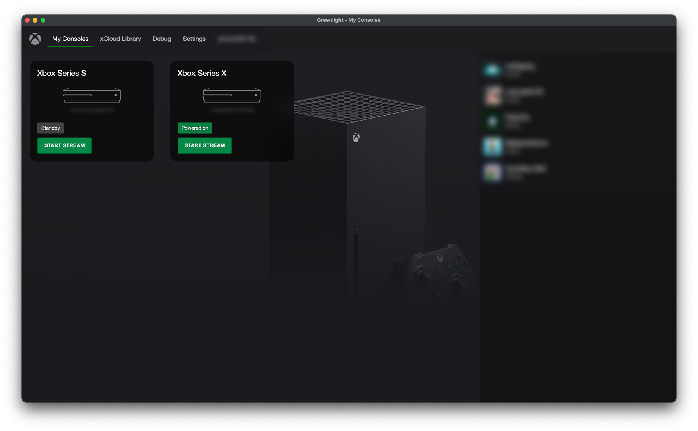

# Greenlight

Greenlight is an open-source client for xCloud and xHome streaming made in Javascript and Typescript. The client is an application wrapper around [xbox-xcloud-player](https://github.com/unknownskl/xbox-xcloud-player).
Application runs on Linux, mac, Windows and Steam Deck.

_DISCLAIMER: Greenlight is not affiliated with Microsoft, Xbox or Moonlight. All rights and trademarks are property of their respective owners._

## Features

- Stream video and audio from the Xbox One and Xbox Series
- Support for gamepad controls
- Supports rumble on xCloud
- Keyboard controls
- Build-in online friends list

 

### Keyboard controls

The following keys are mapped as following:

    Dpad: Keypad direction controls
    Buttons: A, B, X, Y, Backspace (Mapped as B), Enter (Mapped as A)
    Nexus (Xbox button): N
    Left Bumper: [
    Right Bumper: ]
    Left Trigger: -
    Right Trigger: =
    View: V
    Menu: M

### Streaming stats

During the stream you can show extra debug statistics that contain extra data about the buffer queues and other information. To bring this up you have to press `~` on your keyboard.

On the left bottom you can see the status (Altough not always accurate). The right top you can find the FPS of the video and audio decoders including the latency. On the right bottom you can find debug information about the buffer queues and other information that is useful for debugging perposes.

When possible always provide this information with your issue when possible (if it is related).
### Online friends list

The application also provides a way to see which of your friends are online. This can be useful when you want to quickly check if anyone is online to play with :)

## Steam Deck Setup

This application is reported to be working on the Steam Deck with some small bugs and side-effects. You can map one of the Steam Deck back buttons to the 'N' key to simulate the Xbox button.

### Optional launch arguments

| Argument | Description |
|----------|--------------|
| --fullscreen | Starts the application in fullscreen |
| --connect=<value> | Will start stream once the user is authenticated. |

For console use `F000000000000000` format and for xCloud use `xcloud_<title>`

### To close the application

Click on the Xbox logo on the left top. It will ask you to confirm to close the window.

## Install

You can either compile the project yourself or download the (unsigned) executable from the [releases](https://github.com/unknownskl/greenlight/releases) page

## Local Development

### Requirements

- Rust ([https://rustup.rs/](https://rustup.rs/))
- NodeJS ([https://nodejs.org/](https://nodejs.org/))
- Yarn ([https://yarnpkg.com/](https://yarnpkg.com/))

### Steps to get up and running

Clone the repository:

    git clone https://github.com/unknownskl/greenlight.git
    cd greenlight
    git submodule update --init --recursive

Install dependencies:

    yarn

Run development build:

    yarn dev

Create production build:

    yarn build

## Changelog

See [changelog](CHANGELOG.md)