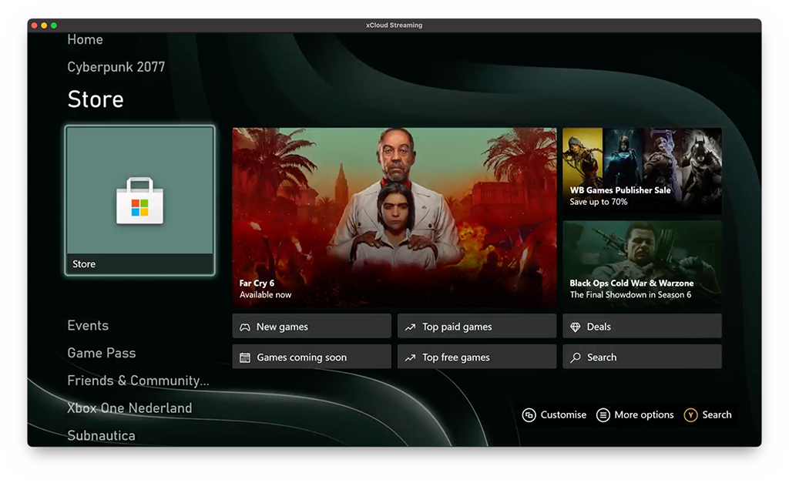

# Greenlight

Greenlight is an open-source client for xCloud and Xbox home streaming made in Javascript and Typescript. The client is an application wrapper around [xbox-xcloud-player](https://github.com/unknownskl/xbox-xcloud-player).
The application runs on Linux, macOS, Windows and Steam Deck.

_DISCLAIMER: Greenlight is not affiliated with Microsoft, Xbox or Moonlight. All rights and trademarks are property of their respective owners._

## Features

- Stream video and audio from the Xbox One and Xbox Series
- Support for gamepad controls
- Supports rumble on xCloud
- Keyboard controls
- Build-in online friends list

 

## Install

### Install from Flathub:
[Install on Flathub](https://flathub.org/apps/details/io.github.unknownskl.greenlight)

### Download pre-compiled binaries:
[Latest releases can be found here](https://github.com/unknownskl/greenlight/releases).

### Compile from source

See [Local development](?tab=readme-ov-file#local-development).

## Keyboard controls

Keys are mapped as following by default:

    Dpad: Keypad direction controls
    Buttons: A, B, X, Y, Backspace (Mapped as B), Enter (Mapped as A)
    Nexus (Xbox button): N
    Left Bumper: [
    Right Bumper: ]
    Left Trigger: -
    Right Trigger: =
    View: V
    Menu: M

## Streaming stats

During the stream you can show debug statistics that contain extra data about the buffer queues and other information. To bring this up you can press `~` on your keyboard.

At the bottom-left you can see the status (although not always accurate). At the top-right you can find the FPS of the video and audio decoders including the latency. At the bottom-right you can find debug information about the buffer queues and other information that is useful for debugging perposes.

When possible always provide this information with your issue, if it is related.

## Online friends list

The application also provides a way to see which of your friends are online. This can be useful when you want to quickly check if anyone is online to play with :)

## Steam Deck Setup

This application is reported to be working on the Steam Deck with some small bugs and side-effects. You can map one of the Steam Deck back buttons to the 'N' key to simulate the Xbox button.

## Optional launch arguments

| Argument | Description |
|----------|--------------|
| --fullscreen | Starts the application in fullscreen |
| --connect=<value> | Will start stream once the user is authenticated. |

For console use `F000000000000000` format and for xCloud use `xcloud_<title>`.

## To close the application

Click on the Xbox logo at the top-left. It will ask you to confirm to close the window.

## Local Development

### Requirements

- NodeJS ([https://nodejs.org/](https://nodejs.org/))
- Yarn ([https://yarnpkg.com/](https://yarnpkg.com/))

### Steps to get up and running

Clone the repository:

    git clone https://github.com/unknownskl/greenlight.git
    cd greenlight

Install dependencies:

    yarn

Run development build:

    yarn desktop dev

Create production build:

    yarn desktop build

## Translations

Want to help out with new translations? Help us on [Poeditor.com](https://poeditor.com/join/project/9SfHRQDbfN)

## Changelog

See [changelog](https://unknownskl.github.io/greenlight/docs/desktop/changelog).